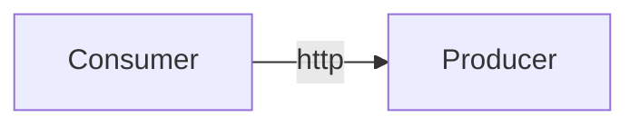

# Contract testing

In order to introduce contract testing in the simplest terms, we'll go through a mixed practice interleaved with as
much documentation as possible. The main idea behind this testing practice is to be able to **quickly spot breaking API
changes** between a producer and a consumer. All of this process should be **offline**, **deterministic** and **should
not** involve spawning any real http application locally !!! If you want to learn more about the concept, I warmly
invite you to read [what Martin Fowler has to say about it](https://martinfowler.com/bliki/ContractTest.html).

It **must not** be confused with end-to-end tests as it does not aim at all to replace them ; it's the opposite
actually, they are complementary. Their goal is to have the shortest feedback loop possible are detect early on mistakes
before running those onerous e2e CI pipelines where you'll get the confidence that your code is ready to be shipped in
production.

## What is it ?

Contract test **are not** about testing functional things ! To be more explicit, imagine you have a `User`
endpoint with the following json response:

```json
{
  "name": "alice",
  "age": 42
}
```

Given this endpoint, your contract test will just verify that `"name"` is a json string and `"age"` a json number,
that's it ! On the other hand, your e2e test will probably create a user Alice with age 42 and then verify that your
endpoint returns the exact same data with the same values.

## Producer & consumer



Most of the time you will use this kind of testing when you have many application communicating over http. In this
situation we will call:

* `producer`: the application exposing a http API (could be REST or SOAP for what it's worth). We will write one (or
  many) stubs for each http endpoint. We could as well write stubs once and then let them rot. The risk would be that
  while the API evolves, our stub stops representing it accurately. To prevent that, we will `verify` the stubs we write
  i.e. we will generate real http requests from the stubs and run them against a real instance of the application to
  assert that it does what it claims in the stub. And now we can confidently share our stubs with the outside world and
  our consumers.
* `consumer`: application with a http client calling a producer http application. The consumer first has to fetch stubs
  exposed by the producer. Then it can mount them with stubr to mock the producer in its unit tests. It brings the
  consumer the benefits of being able to lean on verified stubs and to carefully pick a specific version of the
  producer. Along its lifetime, whenever the producer releases a new version, the consumer will be able, even in a
  semi-automated way (dependabot), to verify it is still compatible with the producer API.

## Producer/consumer driven

There are 2 schools when it comes to contract testing: producer-driven & consumer-driven.

In consumer-driven (for example [Pact](https://docs.pact.io/)), multiple consumers define the contract which then has to
be respected by the producer (summarizing). This has the advantage of taking into consideration every single consumer
but has some drawbacks. First, every consumer has to manually write/copy the same producer mock ; imagine a microservice
fleet with a producer consumed 100 times, hence its mocks re-defined in all 100 consumers. Then, anytime a consumer
produces a new version, a complex CI workflow has to be triggered to verify that the contract is respected by the
producer. In conclusion, it is not offline.

Producer-driven (for example [Spring Cloud Contract](https://spring.io/projects/spring-cloud-contract)) on the other
hand has the advantage of being straightforward. Producer defines the contract once, publishes it and every consumer has
to adapt. Compared to consumer-driven, this model is better suited for organizations where a team has ownership of all
the applications (when contract definition is easy). It has the major advantage of being offline and not requiring more
than 1 definition of the contract. **Stubr is producer-driven**